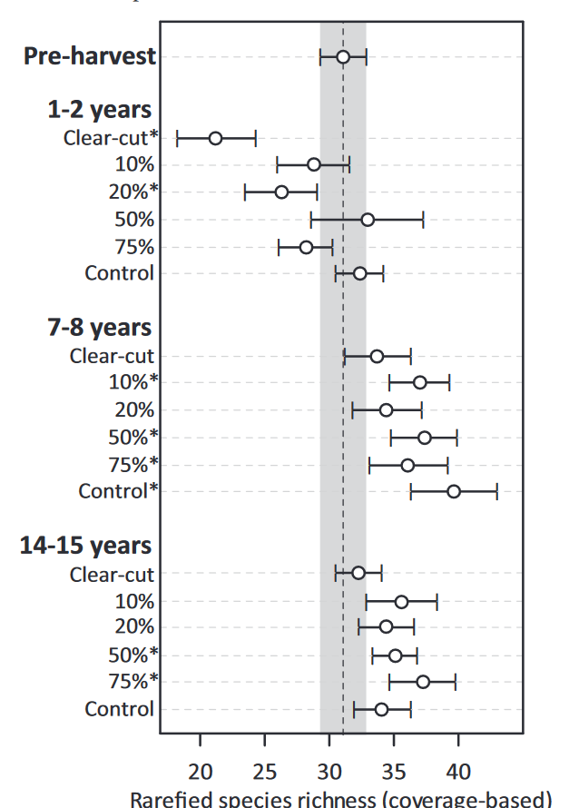

# Community analysis

What are the elogical questions?

Environmental gradients: retnetion patch size, age of harvest, surrounding forest type.

Observed responses: 

1. number of species per location
2. number of individuals of each species per location
3. detection/non-detection of each species per location
4. diversity index

Common approaches:

- logistic regression for each species. 1 model?
- PCA, or clustering
- Functional group response? Probably the "open" species will dislike the retention patches.
- Threshold where some species will really show up? for the richness
- By species, abundance GLM, as Poisson
- By species, piecewise regression, Lionel's paper
- Species richness as response, GLM with the same covariates as my other paper

Community response: What did Connor do?

1. species richness estimates are rarefied to account for varying abundance structures due to different sampling radii (Gotelli & Colwell, 2001), with rarefy form vegan using subsample equal to average speices richness across all sites
2. Randomized block ANOVA to compare rarified species richenss between categorical treatments. (I can't do that)
3. 

The presence of retention does not seem to make a diffenrece in terms of the richness or evenness. The age of the harvest might be negatively associated with there diversity metrics. Also, the interaction of mixedwood and rentetion size is negatively related to these dicversity metrics.

I can do more analyses, but this could simply be what is happeneing: at the community level, there is no evidence that renteiotn patch size confers an advantage to the bird community in regenerating harvests.
There is another avenue to explore: functional traits. I would not be surprised if there are more old forest birds later and in larger patches.

Odsen community analysius of large-scale retention:

1. rarefied speices richenss on x 
2. RDA with blocks of retnetion level, for several groupings of years since harvest 

How to interpret RDA ellipses?

1. The size of the circle: the sites that are within the circle are more or less similar in terms of their species compositions.
2. Overlap: are the categories different form one another?

# Functional Diversity

From Brendan Casey's PhD on hravest retention morphology on community compositions:
> While species diversity has long been used in forestry research, functional diversity (i.e. the value and range of species traits present in a community) are better linked with the underlying processes driving communities (Petchey & Gaston, 2006).

Also, Brendant limited species to those with known breeding ranges in the study region that were detected at a minimum of three survey locations.

